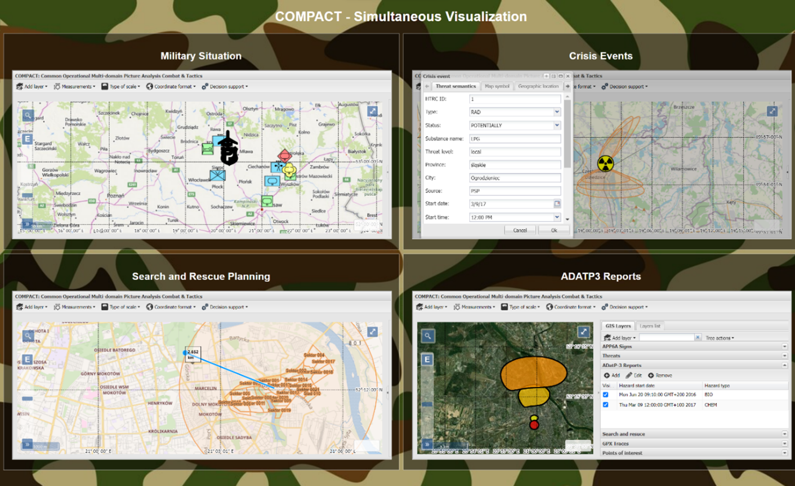

# COMPACT: Common Operational Multi-domain Picture Analysis Combat & Tactics

COMPACT delivers a Common Operational Picture (COP) that fuses tactical, geospatial, and decision-support data into one web experience. The codebase is a Maven multi-module build (GWT client + Spring Boot services) and ships with a ready-to-run deployment bundle under `deploy/`.



### Software Functionalities at a Glance
COMPACT is built from two cooperating parts: a REST API that persists scenarios and enforces business logic, and a SPA front end that constructs the COP. The SPA offers two key workspaces:
- **Configuration View** – assemble base layers, DTED resources, and scenario objects (or clone an existing scenario) to generate the JSON payload delivered to the REST API.
- **Visualization View** – the operational COP cockpit with advanced GIS tooling that supports APP-6C military symbols, ADatP-3 CBRN reports, POI catalogs, SAR search zones, and custom crisis areas managed via the Scenario Object Management tree.

The hero screenshot above (`docs/images/compact_showcase_multi_scenario_embedded.png`) captures both flows working together for multi-scenario comparisons.

## Architecture at a Glance
| Module | Purpose |
| --- | --- |
| `cop-app` | GWT + Spring Boot web tier (client UI, REST adapters, security filters). |
| `cop-services` | REST APIs, integration jobs, Swagger metadata, Feign connectors. |
| `cop-domain` | JPA entities, repositories, auditing support, SAR models. |
| `cop-decisionsupport` | GIS/terrain analytics and scenario solvers. |
| `cop-common` | Shared DTOs/enums used across client and server. |
| `cop-symbol-service` | APP-6/MSWiA symbology pipeline (Batik-based rendering). |
| `deploy/` | Deployment configs plus Docker Compose/Dockerfile bundles (drop the release-provided `cop-app.war` here before running). |

See `docs/modules.md` for deeper notes on responsibilities and dependencies.

## Development Quickstart
### Prerequisites
- JDK 8 (the toolchain depends on GWT 2.8 / GXT 4)
- Maven 3.9+
- Optional: Node + modern browser for GWT dev tools

### Build Everything
```powershell
mvn -f src/pom.xml clean install
```
Outputs land in each module's `target/` folder (e.g., `cop-app/target/cop-app.war`).

### Run the Full Stack
```powershell
mvn -f src/pom.xml -pl cop-app -am spring-boot:run
```
- Reads config from `cop-app/src/main/resources/application.properties` (BoneCP + H2 defaults, port 8888).
- Visit http://localhost:8888 after startup.

For faster UI iteration, run the GWT code server:
```powershell
mvn -f src/pom.xml -pl cop-app gwt:codeserver
```
Then open the bookmarklet at http://localhost:9876 to hot-swap client code.

### Directory Pointers
```
src/
  cop-app/              # GWT/Spring Boot web tier
  cop-services/         # REST + integration services
  cop-domain/           # Entities and repositories
  cop-decisionsupport/  # GIS/decision-support logic
  cop-common/           # Shared DTOs
  cop-symbol-service/   # Symbol pipelines
  pom.xml               # Parent build descriptor
deploy/                 # Docker Compose + Dockerfile bundles (add the release WAR here)
AGENTS.md               # Contributor guide
```

## Deployment Bundle
Operators who only need a runnable system can stay in `deploy/`:
> Download the latest `cop-app.war` asset from this repository's Releases page and place it at `deploy/cop-app.war`. The WAR is no longer tracked in Git, so use a release URL (for example, `curl -L -o deploy/cop-app.war <release-asset-url>`).
1. Ensure Docker Desktop or Engine + Compose is available.
2. (Optional) Edit `deploy/application.properties` (H2 path, DTED path, auth headers).
3. Use **Docker Compose** via `deploy/dockercompose` or build a standalone image from `deploy/docker`.
4. For Compose: `cd deploy/dockercompose && docker compose up -d` (maps Tomcat 8.0 to host port 50090).
5. For Dockerfile: `docker build -f deploy/docker/Dockerfile deploy -t compact:latest && docker run -p 50090:8080 compact:latest`.
6. Browser URL: http://localhost:50090

Detailed instructions, lifecycle commands, and troubleshooting live in `docs/docker.md`.

## GitHub Codespaces
This repo ships with a devcontainer (`.devcontainer/devcontainer.json`) that reuses `deploy/docker/Dockerfile`. Launching a Codespace builds the same Tomcat image, publishes port 50090, and starts the server via `catalina.sh`. After the Codespace boots, open the forwarded port to interact with COMPACT directly from the cloud workspace.

## Documentation
- `docs/modules.md` – module responsibilities, external dependencies, and release intent.
- `docs/docker.md` – how to customize and run the Docker/Tomcat bundles from `deploy/`.
Questions? Start with the guides above, then explore the modules that match your feature area before opening a PR.
