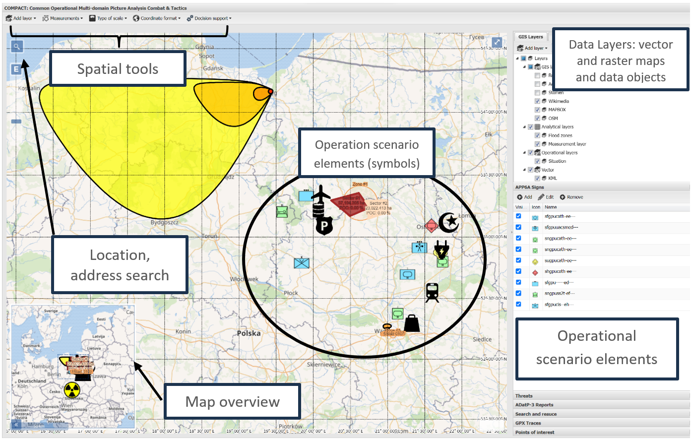
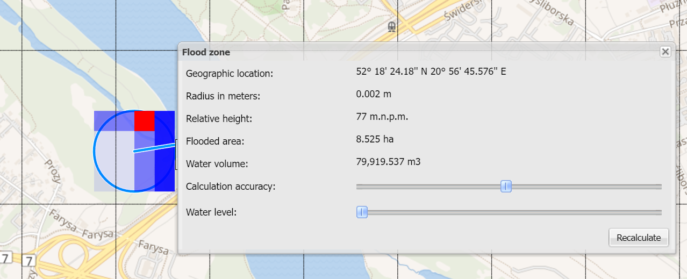
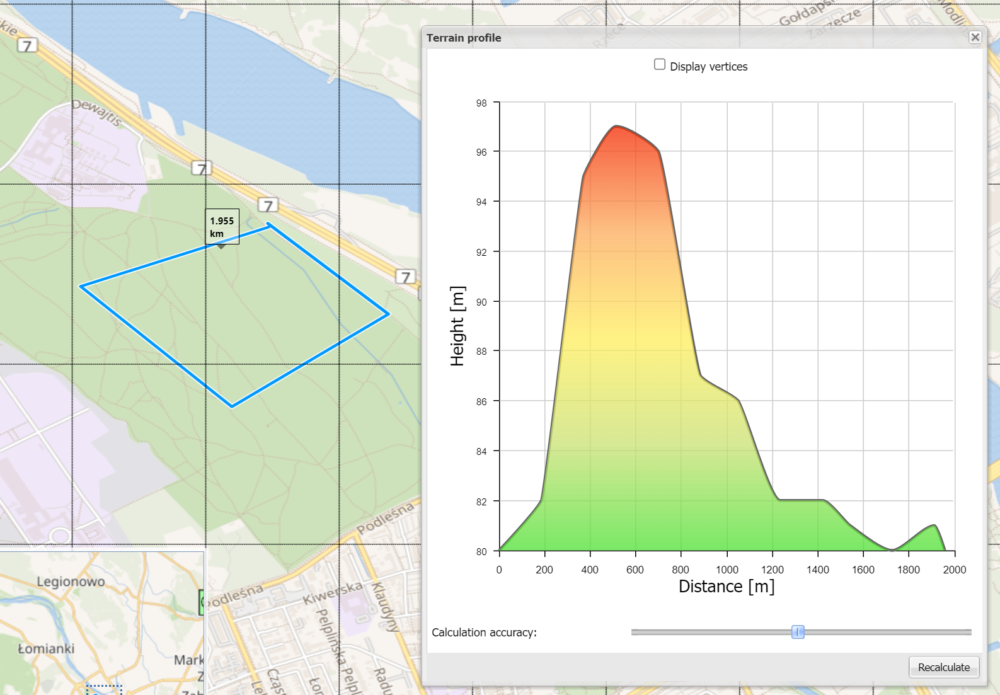
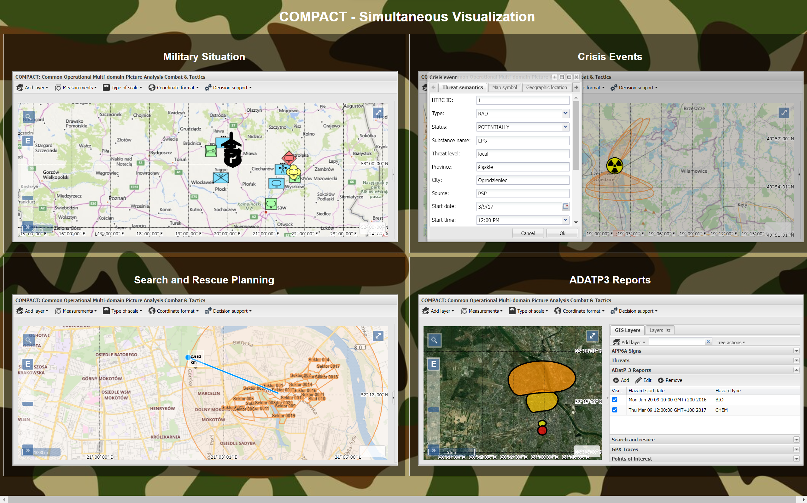

# COMPACT Showcase

COMPACT ships with two tightly coupled parts: (1) a REST API surface that stores scenarios, executes business rules, and streams GIS data, and (2) a COP builder/UI written as a single-page application. The SPA exposes two primary workspaces:
- **Configuration View** – bootstrap a scenario by assembling map components (base layers, DTED references, overlays) and seeding initial objects. Operators can clone prior scenarios, edit geographic metadata, and push the resulting JSON payload back to the REST API to instantiate the mission plan.
- **Visualization View** – the day-to-day COP cockpit. It layers sophisticated GIS tooling on top of the scenario, supports standards such as APP-6C, ADatP-3, MSWiA crisis symbols, POI catalogs, and Search & Rescue heuristics (ring searches, multi-point segments). Objects are organized in the Scenario Object Management tree so users can filter, edit, or animate them without leaving the map canvas.

Combined, these views let planners iterate on a scenario configuration and immediately switch into the operational visualization backed by the same data model.

## Image Gallery
Each screenshot below highlights a different capability. Filenames match the feature demonstrated.

### Main Mission Workspace

The baseline visualization layout with the Scenario Object Management tree on the left and COP canvas centered on multi-layer GIS data.

### Multi-scenario Embedding

Multiple scenarios embedded in a single session to compare plan variants, reuse templates, and synchronize configuration/visualization flows.

### Flood Zone Computing

Hydrology tooling that computes flood envelopes directly on the map, letting analysts test how rising water impacts logistics corridors.

### Line of Sight Computing

LOS analysis that plots observation cones between assets, useful for sensor coverage and SAR sweep planning.

### Situation Visualisation

A composite COP view with APP-6C symbology, ADatP-3 reports, SAR overlays, and user-defined crisis areas displayed simultaneously.
